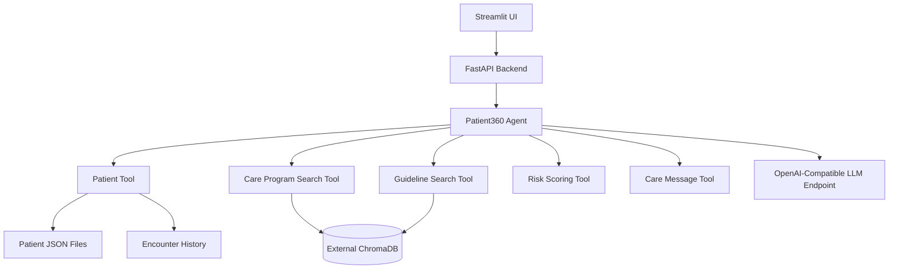

# Patient360 Copilot

Patient360 Copilot is a private-environment demo of an enterprise AI assistant for healthcare care teams. It uses a Streamlit UI, FastAPI backend, generated fictional patient data, generated clinical PDFs, external ChromaDB retrieval, deterministic healthcare tools, and OpenAI-compatible LLM and embedding endpoints suitable for private vLLM deployments.

All patient profiles, encounter histories, care program PDFs, and clinical guideline PDFs are fictional and generated by scripts with fixed random seeds.

## Architecture



## Capabilities

- Retrieval-Augmented Generation over care program and guideline PDFs
- Lightweight OpenAI-compatible tool calling
- Patient profile and encounter analysis
- Care gap and care program recommendations
- Guideline and clinical workflow lookup
- Deterministic patient risk scoring
- Follow-up care message drafting
- Runtime settings UI for LLM, embeddings, and external ChromaDB
- Add A New Patient tab with JSON upload, generated demo data, and editable form

## What Is Not Included

This demo intentionally does not implement authentication, authorization, SSO, RBAC, user management, EHR integration, billing, claims processing, or external SaaS dependencies.

## Project Structure

```text
patient360-copilot/
├── app/
│   ├── api/
│   ├── agent/
│   ├── rag/
│   ├── tools/
│   ├── models/
│   ├── services/
│   └── config/
├── frontend/
│   └── streamlit_app.py
├── scripts/
│   ├── generate_patients.py
│   ├── generate_programs.py
│   ├── generate_guidelines.py
│   ├── generate_encounters.py
│   ├── generate_demo_data.py
│   └── ingest_documents.py
├── data/
│   ├── patients/
│   ├── care_programs/
│   ├── guidelines/
│   └── encounters/
├── charts/patient360-copilot/
├── Dockerfile
├── docker-compose.yml
├── requirements.txt
├── .env.example
├── startup.sh
└── README.md
```

## Local Development

Create and activate a Python 3.11+ environment:

```bash
python -m venv .venv
source .venv/bin/activate
pip install -r requirements.txt
```

Generate fictional demo data:

```bash
python scripts/generate_demo_data.py
```

Configure `.env` from `.env.example`. LLM and embedding endpoints should be OpenAI-compatible. ChromaDB is remote-only and can be left blank until you configure it from the Settings tab.

Start backend and frontend separately:

```bash
uvicorn app.main:app --host 0.0.0.0 --port 8080
streamlit run frontend/streamlit_app.py --server.port 8501
```

Open `http://localhost:8501`. FastAPI docs are available at `http://localhost:8080/docs`.

## Docker Deployment

Docker Compose runs the app as two containers using the versioned image tag `vinchar/patient360-copilot:0.1.0`:

```bash
docker compose up --build
```

The backend startup script generates fictional demo data when missing. If ChromaDB is not configured, the app starts without blocking; configure ChromaDB, LLM, and embeddings in Settings, then click `Reindex documents`.

## Helm Deployment

Package the chart:

```bash
helm package charts/patient360-copilot --destination dist
```

Install with remote model and embedding settings:

```bash
helm upgrade --install patient360-copilot ./dist/patient360-copilot-0.1.0.tgz \
  --namespace healthcare-demo \
  --create-namespace \
  --set image.repository=vinchar/patient360-copilot \
  --set image.tag=0.1.0 \
  --set llm.baseUrl=https://your-llm.example.local/v1 \
  --set llm.model=your-model \
  --set embedding.baseUrl=https://your-embedding.example.local/v1 \
  --set embedding.model=your-embedding-model \
  --set chroma.host=your-chroma.example.local \
  --set chroma.port=443 \
  --set chroma.ssl=true
```

The chart does not deploy ChromaDB. It expects an external ChromaDB HTTP server.

## HPE Private Cloud AI Notes

- Use vLLM or another OpenAI-compatible inference endpoint for `LLM_BASE_URL`.
- Use an OpenAI-compatible embedding endpoint for `EMBEDDING_BASE_URL`.
- Host ChromaDB as a separate private service.
- For air-gapped deployments, pre-stage Python wheels, container images, and model artifacts in the private registry.
- Scale FastAPI/Streamlit separately from inference, embedding, and ChromaDB services.

## Runtime Settings

The Settings tab persists values to `RUNTIME_SETTINGS_PATH`, normally `/app/data/config/runtime_settings.json` in containers and Helm. Tokens are stored there when entered, but they are not returned to the browser.

Settings include:

- LLM endpoint, model, token, TLS verification, and timeout
- Embedding endpoint, model, token, and TLS verification
- ChromaDB host, port, SSL, TLS verification, tenant, and database
- Connection tests for LLM, embeddings, and ChromaDB
- Document reindexing for care program and guideline PDFs

## Demo Data

Generate data:

```bash
python scripts/generate_demo_data.py
```

Example output:

```text
Generated:
- 50 patients
- 8 care program documents
- 6 guideline documents
- 430 encounters
```

Rebuild retrieval indexes:

```bash
python scripts/ingest_documents.py
```

## API

- `POST /chat`
- `GET /patients`
- `POST /patients`
- `GET /patients/demo-profile`
- `GET /patient/{id}`
- `GET /patient/{id}/encounters`
- `GET /settings`
- `PUT /settings`
- `POST /settings/test/{service}`
- `POST /reindex`
- `GET /health`

## Example Prompts

- `Summarize patient 001`
- `What care gaps should we prioritize for patient 014?`
- `Which care programs are relevant for patient 006?`
- `Calculate risk and care-management priority for patient 022.`
- `What guideline evidence applies here?`
- `Draft a follow-up care message for patient 001.`
- `Summarize recent encounters for patient 010.`

## Clinical Safety Note

This is a fictional demo application. It does not provide medical diagnosis or treatment advice. All generated content should be reviewed by qualified clinical professionals before any real-world use.
